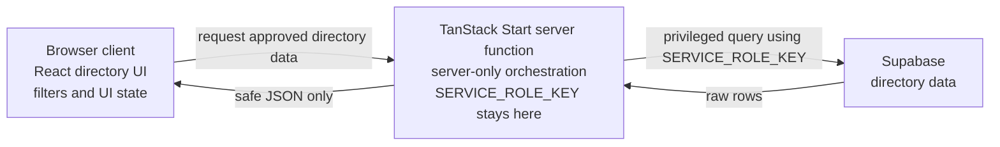

# Client vs Server Inventory — Hockey Operations Directory

## Plain-language model

Think of a restaurant. The dining room is like the browser client: customers can see it, interact with it, and inspect what is on their table. The kitchen is like the server: customers cannot directly inspect its tools, recipes, or storage, so secret ingredients can stay there. Browser code runs on the user's device and can be inspected with DevTools, while server code runs away from the user's device and should keep secrets there. A secret cannot safely live in the browser because anything sent to the browser can eventually be inspected.

For this Hockey Operations Directory, React components run in the browser and render the player and staff directory table. Users also use browser controls to change filters and other UI state. Supabase stores the directory data, but the Supabase service-role key is a secret and must never reach browser code. Privileged Supabase queries should run on the server. A TanStack Start server function will eventually sit between the browser and Supabase: the browser asks for approved directory data, and the server performs the privileged read and returns only the data the browser needs.

## 1. Safe on the browser client

These responsibilities belong in browser-facing code because the user needs to see or interact with them. They must not require a secret credential.

- **Player/staff directory UI**
  - **Why:** The directory table is the visible product, so React must render it in the browser.
- **React components**
  - **Why:** React components create the browser interface and respond to user interaction. They should receive display data rather than privileged database access.
- **Filter controls and UI state**
  - **Why:** A user needs to select player or staff filters in the browser. Filter selections are interaction state, not database credentials.
- **Loading and empty states**
  - **Why:** These are presentation states that explain what the user sees while data is loading or when no matching directory entries are available.
- **Rendering data returned by a server function**
  - **Why:** The browser must display approved player and staff data after the server function responds. The response should contain safe directory data, not secrets or unrestricted database results.
- **Truly public configuration, if applicable**
  - **Why:** A value explicitly designed for browser use can be included in client code. A public value is not permission to expose `SERVICE_ROLE_KEY`, another secret credential, or a value merely because it has a convenient name.

A pure mapper or filter helper may also be usable on the client or shared between client and server when it has no database access and does not read secrets. It still needs separate tests and careful imports, but it is not automatically server-only just because it handles directory data.

## 2. Must stay on the server

These responsibilities must remain behind the TanStack Start server boundary.

- **Supabase service-role key**
  - **Why:** `SERVICE_ROLE_KEY` is a secret credential with privileged access. Browser users can inspect bundled JavaScript, network requests, and runtime values, so it must never be sent to the browser.
- **Other secret credentials**
  - **Why:** Database passwords, private tokens, and other secret environment values can be abused if exposed. They must be loaded and used only by server code.
- **Privileged Supabase client construction**
  - **Why:** Creating a Supabase client with a service-role key connects the client to a privileged capability. The construction must happen in a server-only module so the credential cannot enter the browser dependency graph.
- **Raw database or RPC reads using privileged credentials**
  - **Why:** These reads use the protected Supabase connection and may return more fields than the browser should receive. The server should perform the read and select or map the approved output.
- **Privileged access decisions**
  - **Why:** Deciding whether a request may use a privileged directory read is a security decision. It cannot rely only on a browser-controlled filter, flag, or hidden UI element.
- **Server-side orchestration for directory reads**
  - **Why:** Coordinating environment loading, the server-only Supabase client, query inputs, error handling, and safe output belongs in one server-side path. This is the work the TanStack Start server function will eventually expose to the browser.

The intended flow is therefore:

`Browser client -> TanStack Start server function -> Supabase`

The service-role key exists only in the server-side portion of that flow. A React component that imports a server-only Supabase client or embeds `SERVICE_ROLE_KEY` has crossed the boundary incorrectly and should be rejected.

## 3. Boundary questions still open

- Which environment variables are intentionally public, and which are server-only? The final names must be agreed later; a secret must not be placed in a Vite `VITE_*` variable.
- What exact request and response shape should the TanStack Start server function use for player and staff directory reads?
- Which player and staff fields may be returned to the browser, and which fields must remain server-side?
- Should filters be translated into the Supabase database query, applied after the read in pure helper functions, or split between those approaches?
- Which pure mapper and filter helpers should be shared, and which server-only orchestration should remain isolated from browser imports?

## How I will use this inventory later

I will compare future AI-generated code against this inventory and the Step 1 notes in [docs/boundary-risk-notes.md](boundary-risk-notes.md) before accepting it. I will reject client code that imports server-only modules, constructs a privileged Supabase client, embeds `SERVICE_ROLE_KEY`, reads secret environment variables, or makes privileged Supabase requests directly from React. I will check that the browser calls the TanStack Start server function and receives only the approved directory data.
